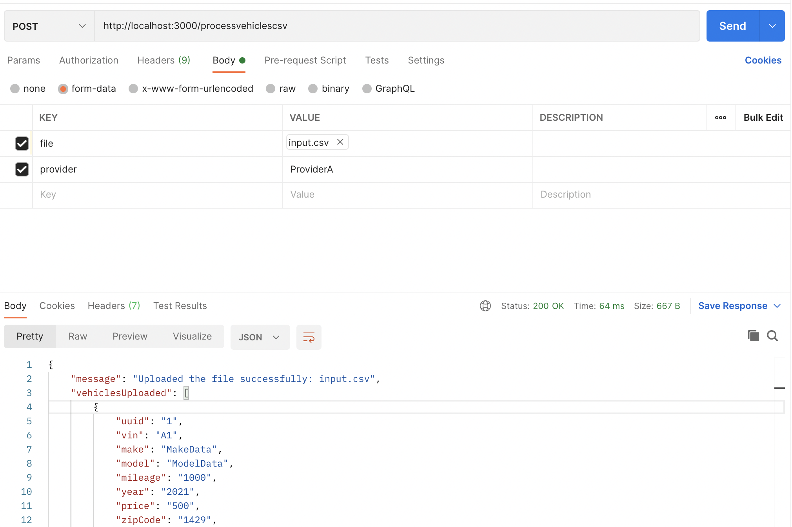
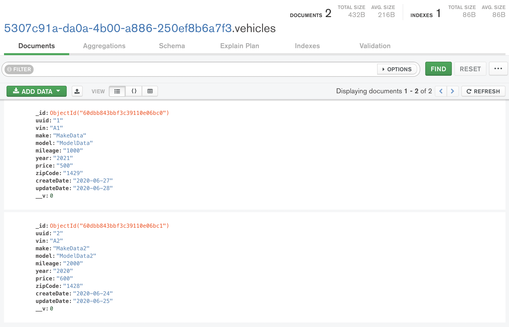
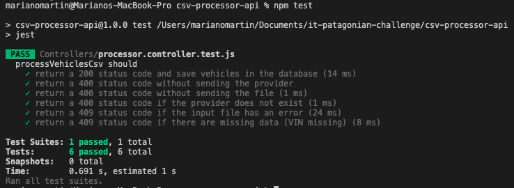

# Backend Coding Challeng - Patagonian IT

## The challenge

I developed an API with a single endpoint `/processvehiclescsv` to process csv files and save the information in an in-memory database. The endpoint is using the `provider` name to get the csv format to parse from the database.

## Run the project

1. In `./csv-processor-api` execute the following commands:

```
npm i
npm start
```

2. From Postman (or any application to send POST requests) send the following request:

    - **url:**  http://localhost:3000/processvehiclescsv

    - **body (form-data):**
        *file*: upload the csv file to process, you can find one in `csv-processor-api/Controllers/testFiles/correct.csv`
        *provider*: `ProviderA`
    
    - **Request type:** POST

    **IMPORTANT: if you want to test the API with a diferent csv format it's necessary to edit (or add) the provider configuration in `csv-processor-api/Utils/memorydb.js`.**

3. You will get a 200 response with the vehicles uploaded to the database. If you want to check the devices in the database you can find the mongo db connection string in the terminal from you executed the API.

    *request from PostMan*
    

    *Vehicles in the database*
    

## Execute tests

In `./csv-processor-api` execute the following command:

```
npm test
```



## Tech stack and tools

- NodeJS with Express
- ESLint using `airbnb-base`
- Multer
- Nodemon
- fast-csv
- jest
- mongodb-memory-server
- mongoose

## Future improvements

- Parse and validate dates from the input files and save in the right format in the database
- Provide an endpoint to add and update providers configurations
- Validate if each vehicle exists in the database before adding it to the database
- Delete the input file from the temp directory after processing it